# Manual de usuario

Gracias a este manual sabremos todas las funciones de la aplicación Phergeon.

Registrarse
------------------------
Para registrarnos en la aplicación necesitamos ir a la pestaña de "Login" del menú de navegación situado en la parte superior de la web, una vez dentro de dicha pestaña clickamos sobre el boton de "Registrate", y una vez dentro necesitas llenar el formulario con sus correspondientes datos y ya estarás dentro de la aplicación como usuario.

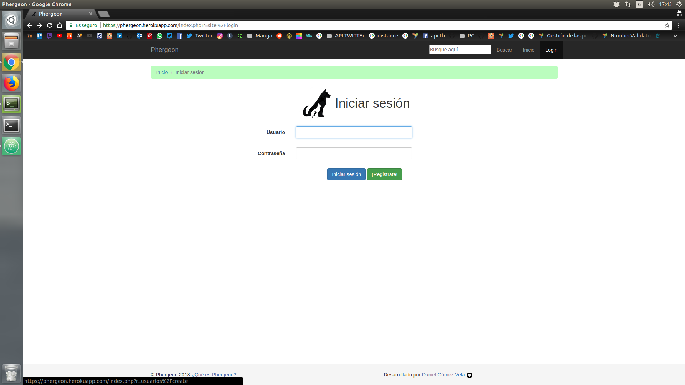

-----------------------------------------------
Login
------------------------

Una vez nos hayamos registrado, volvemos a la pestaña de "Login", y en el formulario que se nos presenta rellenamos con nuestras credenciales los correspondientes campos.

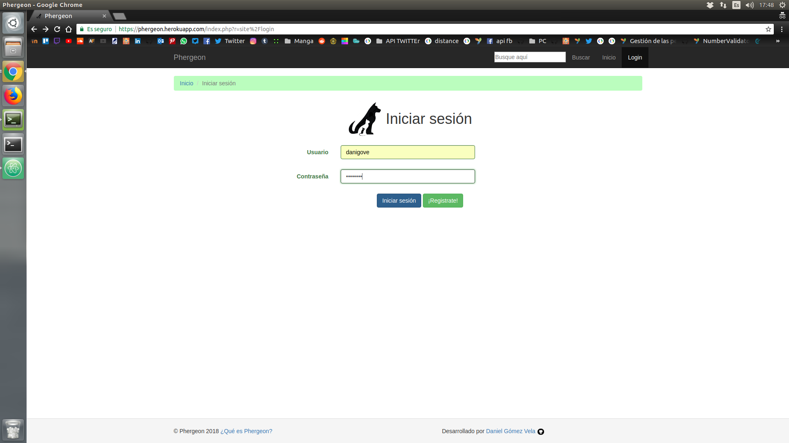

-----------------------------------------------

Cerrar sesión
------------------------
Una vez nos logueemos para desconectarnos de la aplicación solamente clicaremos en el botón de "Logout" que se encuentra donde anteriormente estaba el de "Login".

-----------------------------------------------

Modificar datos de usuario
------------------------
La pestaña de "Mi perfil" situado en la barra de navegación nos llevará a la página donde se nos mostrará nuestro perfil con nuestros datos y una serie de botones, los cuales uno de ellos será el de "Modificar perfil", el cual nos abrirá un formulario en el que podremos meter nuestros nuevos datos y al darle al botón de guardar se actualizarán todos nuestros datos.

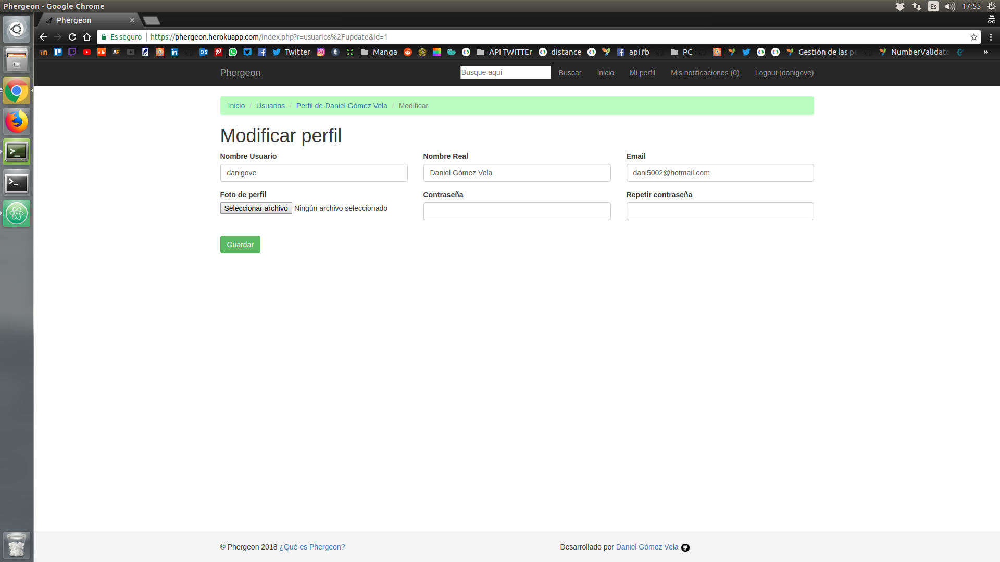

-----------------------------------------------

Darte de baja
------------------------
Si crees que tu labor en la página está terminada y quieres cerrarte la cuenta, con ir a tu perfil y darle al botón de "Darte de baja", con su correspondiente confirmación te hará eliminar tu cuenta de la aplicación.

-----------------------------------------------

Autenticarte como protectora animales
------------------------
Si se da el caso de que el usuario es una protectora animal y quiere verificarse para tener un mayor hueco en la aplicación (ya que tiene un mayor número de animales que quieren buscar un hogar), en la pestaña de "Mi perfil", junto con algunos de los botones citados anteriormente se encuentra el botón de "Autenticarte", el cual nos manda un correo a nuestro email que hayamos determinado en la cuenta.

Dicho email viene con una url, la cual nos redirigirá a una parte de la aplicación que nos validará y autenticará como una protectora

-----------------------------------------------
Buscar
------------------------
Si queremos un tipo de animal en concreto, o hemos oido hablar de alguna protectora animal que tengamos cerca y queramos saber que animales tienen para adoptarlos porque nos pille más cerca, podremos buscar en el buscador que se encuentra en la barra de navegación e introduciendo parte del nombre o del tipo de animal que querramos buscar, nos aparecerá una página con todos las coincidencias que se encuentren en la apliación.

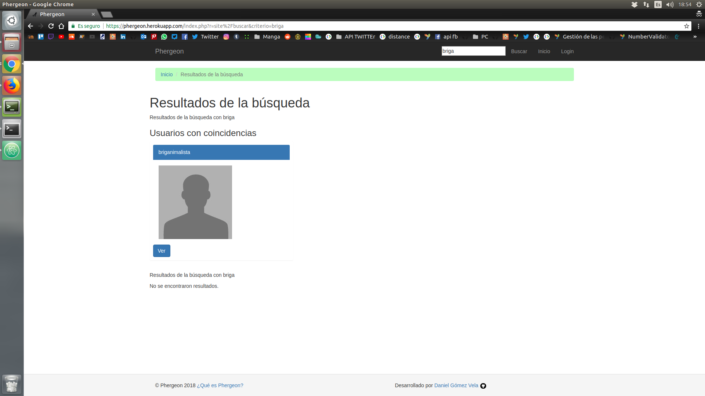

-----------------------------------------------

Subir un nuevo animal
------------------------
En la página principal de la aplicación, cuando estemos logueados con nuestra respectiva cuenta, aparecerá un botón de "Crear nuevo animal", pues pulsamos en ese botón y dicha acción nos llevará a un formulario en el cual tendremos que llenar con los datos correspondientes cada uno de los distintos campos que determinan características del animal (Raza, edad, etc)
Una vez terminemos pulsamos el botón de subir y nuestro animal ya tendrá sus datos en la plataforma a la espera de que alguien se fije en él/ella.

-----------------------------------------------

Modificar Animal
------------------------
Si entramos en el perfil de un animal y éste lo hemos subido nosotros nos aparecerán una serie de botones, entre los cuales el de "Modificar animal", el cual, si clicamos sobre él, nos llevará a un formulario el cual podremos rellenar con los nuevos datos que queramos o cambiar algún elemento que necesitemos corregir del animal.

-----------------------------------------------

Eliminar animal
------------------------
Al lado del botón citado anteriormente, encontraremos el botón de "Eliminar", el cual nos sirve para borrar al animal de la plataforma, su funcionamiento es tan simple como pulsar sobre él y, posteriormente, clicar sobre el botón aceptar de la confirmación.

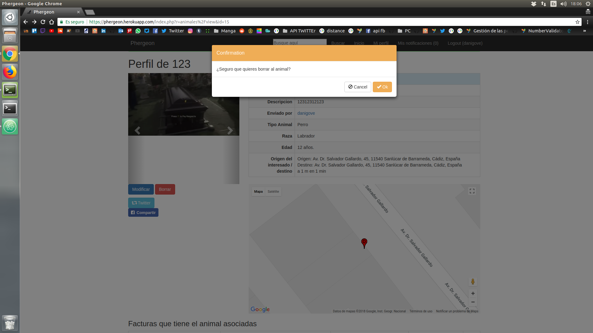

-----------------------------------------------

Compartir al animal por distintas redes
------------------------

En el perfil de cualquier animal, estemos logueados o no, nos aparecerán una serie de botones de distintas redes sociales (en este caso Facebook y Twitter).
Dependiendo de qué botón le demos, saldrá una ventana en la cual aparecerá ya la publicación de manera preconstruida y lista para ser publicada en cada una de las distintas redes sociales, con el objetivo de poder a hacer llegar a mas gente el anuncio del animal.

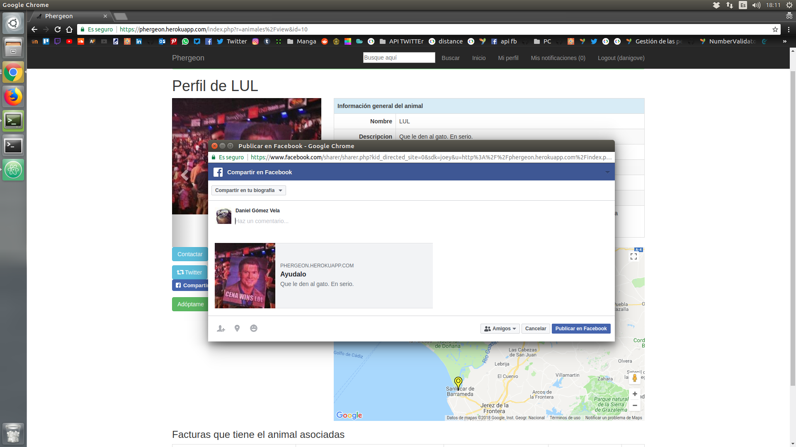
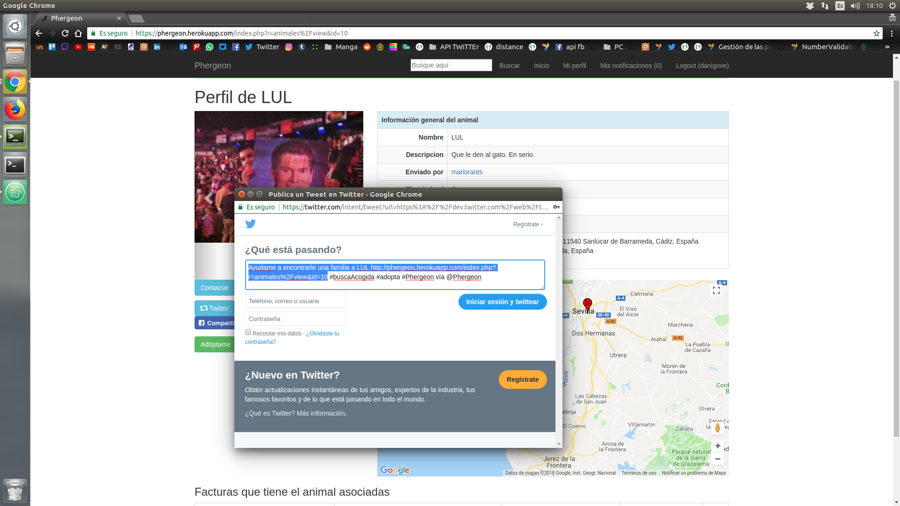
-----------------------------------------------

Añadir nueva factura asociada al animal
------------------------

Si somos propietarios del animal del perfil en el que nos encontramos, aparecerá un botón que nos permitirá añadir facturas médicas que tenga el animal (alguna operación que haya hecho falta pagar a la hora de rescatarlo, castración, etc).
Cuando pulsemos dicho botón (Añadir nueva factura) aparecerá dentro de la misma página un formulario en el cual meteremos los datos necesarios para crear la factura, y ya el usuario que quiera contribuir se tendrá que poner en contacto con el centro veterinario y hacer la transferencia (esa operación va de manera externa a la página, esta función es meramente informativa).

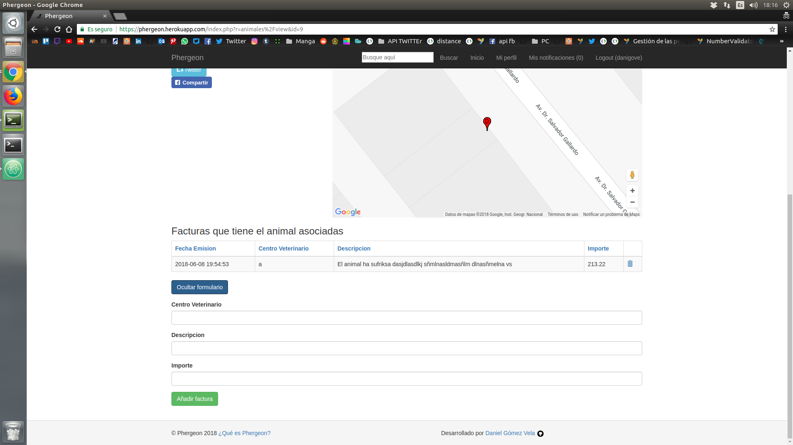

-----------------------------------------------

Contactar con el propietario del animal
------------------------
Dentro de la pestaña de cada animal, encontraremos un botón de "Contactar", el cual nos permite poder mandarle un mensaje preguntando por las condiciones del animal, o en caso de que el animal te interesase, poder preguntar por un punto de encuentro para la entrega del animal.

Una vez pulsamos el botón nos saldrá un formulario en el cual podremos escribir el contenido del mensaje, y una vez hayamos terminado, pulsamos el botón de enviar y se le enviará el mensaje al usuario.

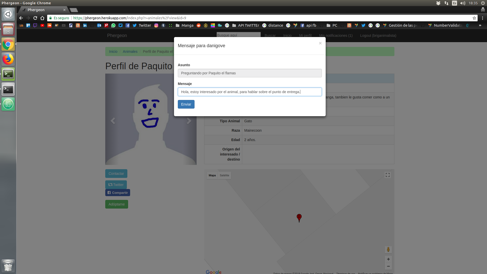

-----------------------------------------------

Responder a un mensaje
------------------------
Dentro de la pestaña de "Mis notificaciones" hay una pestaña de mensajes recibidos, pues en cada uno de los distintos mensajes nos encontraremos con el botón de responder, el cual, si lo pulsamos, nos aparecerá un formulario con el campo para mandarle el mensaje que queramos al usuario que haya preguntado por alguno de nuestros animales.

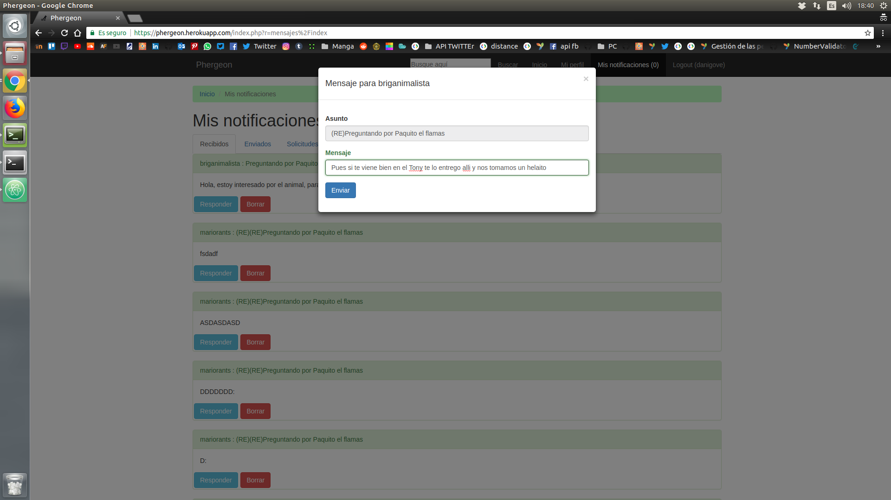
-----------------------------------------------

Borrar mensaje
------------------------
Siempre que queramos borrar algún mensaje que nos hayan enviado o hayamos enviado, al lado del botón de responder citado anteriormente tenemos un botón de borrado, el funcionamiento es tan simple como pulsarlo y confirmar el borrado de dicho mensaje.

-----------------------------------------------

Solicitar adopción del animal
------------------------
Cuando estamos en el perfil del animal y estamos interesados en el animal tendremos un botón "Adóptame", en el cual el usuario, si es distinto del que ha subido el animal, mandará una solicitud de adopción al usuario, el cual éste aceptará o no dependiendo del juicio del usuario que ha subido el animal a la plataforma.

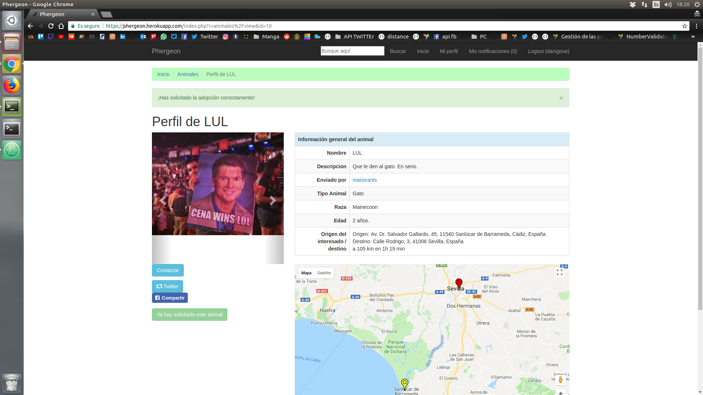

-----------------------------------------------

Denegar solicitud
------------------------
Si alguien ha solicitado la adopción de uno de nuestros animales pero por ejemplo, el usuario que lo ha solicitado no nos ha contactado de ninguna manera o sea sospechoso de fraude, podemos denegar dicha solicitud yendo a nuestra pestaña de solicitudes dentro de la pestaña "Mis notificaciones".

Para denegar dicha solicitud simplemente tenemos que pulsar el botón de "Denegar solicitud" y eliminaremos dicha solicitud.

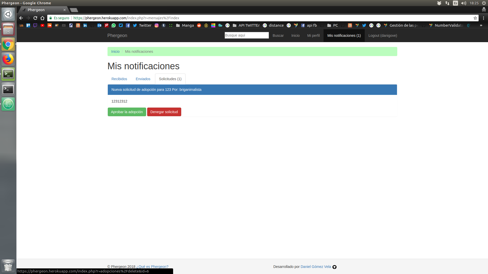

-----------------------------------------------

Aprobar solicitud
------------------------
Si hemos llegado a un acuerdo con el usuario que está interesado con el animal y lo hayamos entregado ya a dicho usuario, para que tenga constancia en la página que dicho animal ya tiene una nueva casa, se aprueba la solicitud en la misma pestaña de solicitudes dentro de la pestaña de "Mis notificaciones" situada en la barra de navegación.

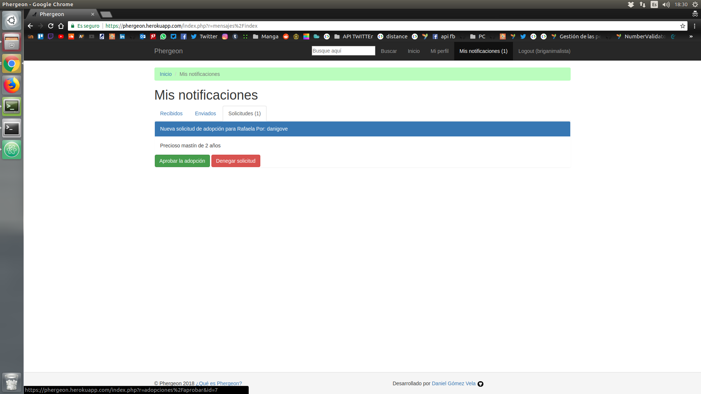
-----------------------------------------------
